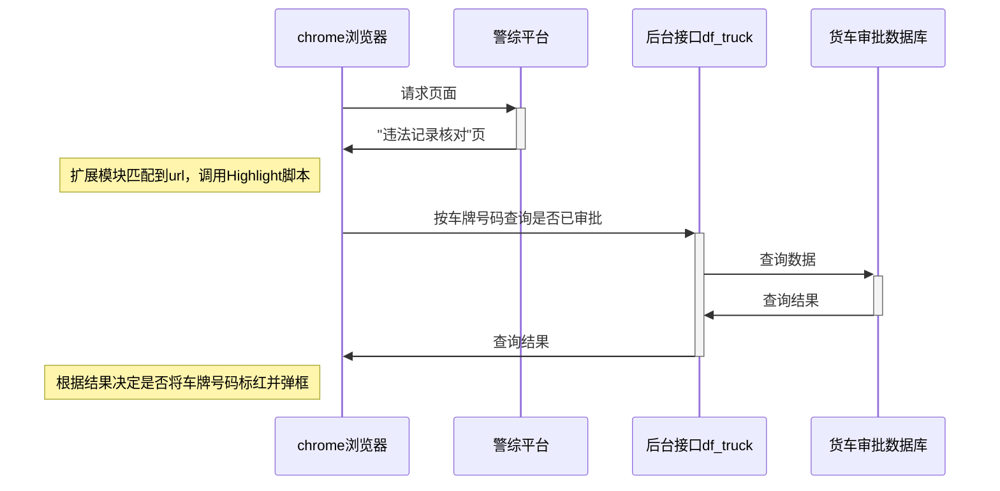

# 大丰货车审批结果查询接口

## 配置

配置文件位于当前目录，名为`.env`，用于设置接口程序的端口号、后台mysql数据库的地址、账号、密码等，举例如下：
```
PORT=8080
DBHOST=localhost
DBUSER=root
DBPASS=its312
DBNAME=df_fw_truck
```

## 运行

接口程序只有一个可执行文件`df_truck.linux`，测试时直接运行`./df_truck.linux`即可，正式运行时可以用`nohup`以后台运行方式启动。启动后可以用`curl`测试接口是否正常返回结果，如下：
```
curl -v http://localhost:8080/query?p=苏J88888
```

## 前端脚本配置及测试

将`Highlight`脚本中的以下一行修改为后台接口实际运行的地址和端口：
```
    var backend_host = 'http://localhost:8080';
```

为`chrome`安装好`Tempermonkey`扩展，再安装`Highlight`脚本并启用，打开警综平台，跳至"违法记录核对"页。当页面加载完成后，脚本会检查其中的违法车牌号，以车牌号作为参数调用后台的查询接口，如果调用失败会弹出提示框，如果调用成功且审批结果为`已通过`，则将车牌号码标红色同时弹出提示框显示审批的通行时间，否则不修改页面。

## 时序图


